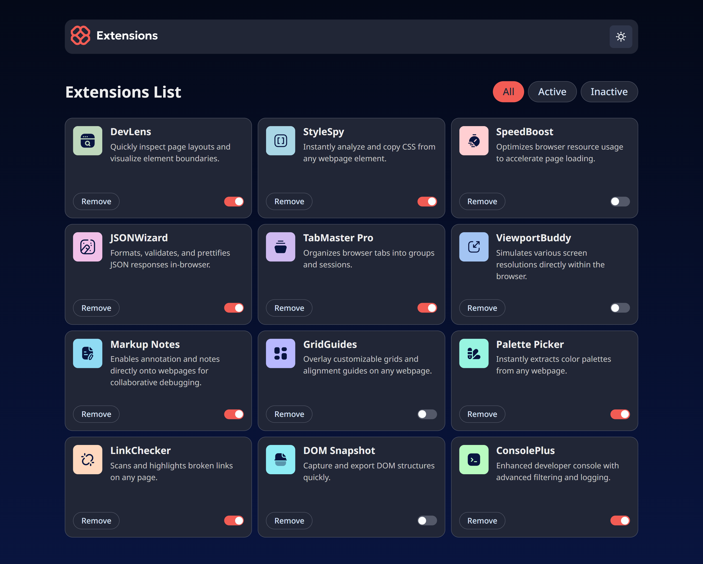

# Frontend Mentor - Browser extensions manager UI solution

This is a solution to the [Browser extensions manager UI challenge on Frontend Mentor](https://www.frontendmentor.io/challenges/browser-extension-manager-ui-yNZnOfsMAp). Frontend Mentor challenges help you improve your coding skills by building realistic projects.

## Table of contents

- [Overview](#overview)
  - [The challenge](#the-challenge)
  - [Screenshot](#screenshot)
  - [Links](#links)
- [My process](#my-process)
  - [Built with](#built-with)
  - [What I learned](#what-i-learned)
- [Author](#author)

## Overview

### The challenge

Users should be able to:

- Toggle extensions between active and inactive states
- Filter active and inactive extensions
- Remove extensions from the list
- Select their color theme
- View the optimal layout for the interface depending on their device's screen size
- See hover and focus states for all interactive elements on the page

### Screenshot

### Links

- Solution URL: https://www.frontendmentor.io/solutions/extension-manager-with-svelte-typescript-design-system-SCtG2INmAP
- Live Site URL: https://drumstickz-extension-manager.netlify.app/

## My process

### Built with

- [Svelte](https://svelte.dev/) - Reactive JS framework
- [Vite](https://vite.dev/) - Build tool
- [Typescript](https://www.typescriptlang.org/) - A statically typed language that compiles to JS

### What I learned

- I learned how to work with Svelte and reactive JS workflow
- I learned to use CSS custom properties for creating a design system and light/dark theme.
- I learned a little bit of Vite, but didn't need to dive that deeply into it.
- I learned how use TS and how to integrate it into Svelte for typesafe props and state.

### Issues I encountered

When I tried to set the src of an `` element in a `.svelte` component markup, Vite correctly served the image when running in dev, but did not bundle them when building for prod. I discoverd that I had to import the assets in the `<script>` of the component.

## Author

- Frontend Mentor - [@Drumstickz64](https://www.frontendmentor.io/profile/Drumstickz64)
- Github - [@Drumstickz64](https://www.github.com/Drumstickz64)
